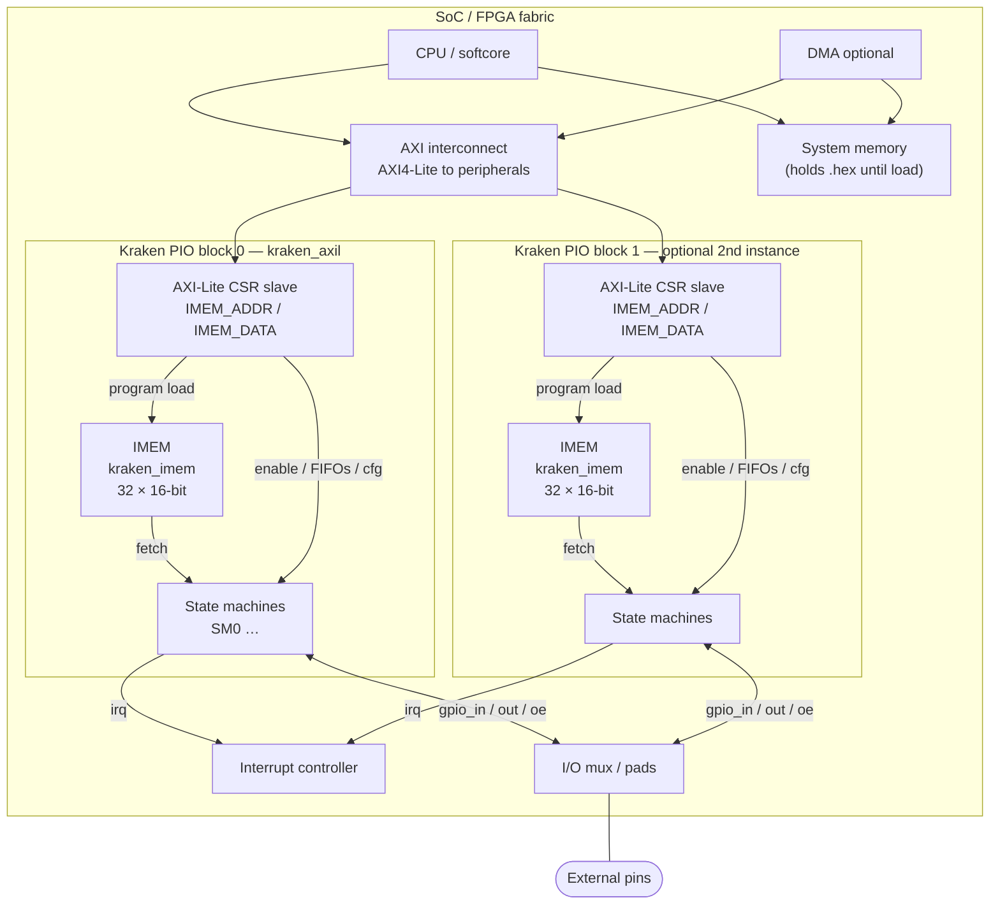
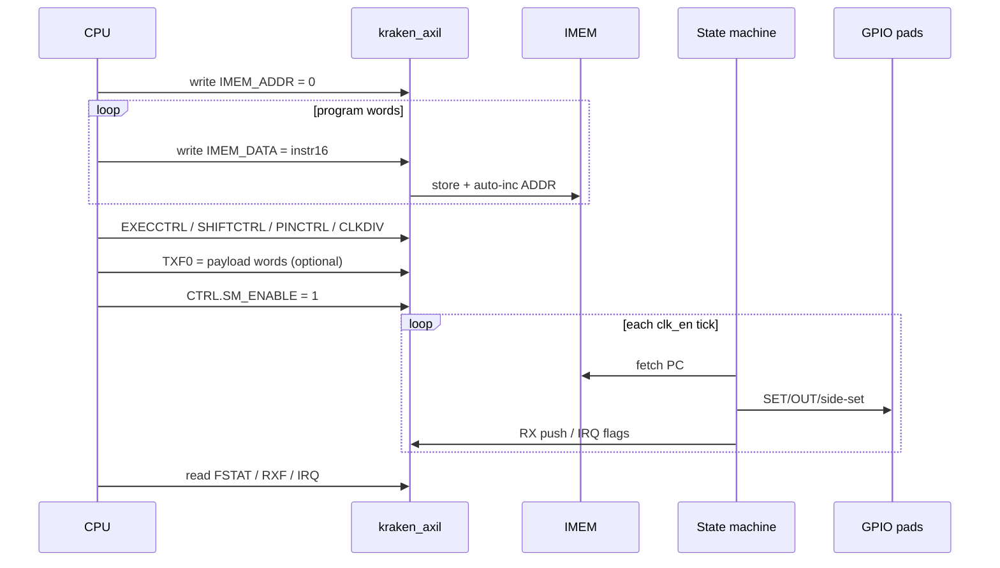
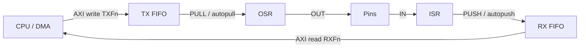
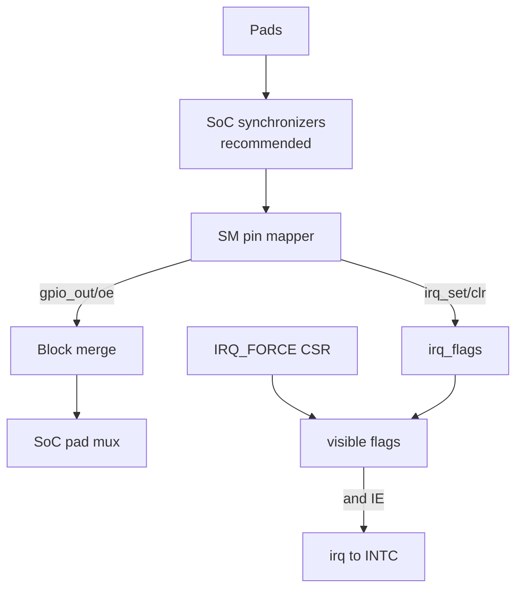

# Kraken IO — System Architecture

**Status:** living architecture note  
**Audience:** SoC integrators and FPGA bring-up  
**RTL entry points:** `kraken_axil` (AXI4-Lite host) · `kraken_io` (flat-port core)

This document shows how Kraken sits in a larger SoC: CPU/DMA on a bus, shared instruction memory, state machines, FIFOs, GPIO, and interrupts.

Related:
- CSR offsets: [`docs/axil_csr_map.md`](docs/axil_csr_map.md)
- Feature status: [`kraken_support.md`](../kraken_support.md)
- ISA / behavior: [`pio_derived_spec.md`](../pio_derived_spec.md)

---

## 1. SoC context (where Kraken lives)

A typical integration puts one or more **Kraken PIO blocks** on a peripheral interconnect. The CPU (or a DMA engine) programs the **on-block IMEM** and FIFOs over **AXI4-Lite**; pads are sideband, not memory-mapped.

**IMEM is inside Kraken** (`kraken_imem`) — it is *not* the SoC’s system DRAM/SRAM. System memory only holds the `.hex` image until the CPU copies it into IMEM via CSR writes.



Each block has its **own** IMEM instance. Two Kraken blocks do not share program memory unless you deliberately redesign that.

**Integration contract (per `kraken_axil` instance):**

| Port group | Direction | Role |
| --- | --- | --- |
| `s_axil_*` | Slave | CSR + FIFO + IMEM programming |
| `gpio_in` | In | Sampled pin levels (after SoC sync / mux) |
| `gpio_out` / `gpio_oe` | Out | Drive levels / output enables |
| `irq` | Out | Level IRQ to SoC INTC (`IE` masked) |
| `clk` / `rst_n` | In | System clock / reset |

GPIO ownership (which Kraken / which CPU GPIOCTRL) is **outside** this IP today — the SoC mux merges `gpio_out`/`gpio_oe` from all drivers.

---

## 2. Inside one Kraken block

Hierarchy matches the RTL:

```text
kraken_axil          AXI-Lite + CSRs + per-SM Pico 16.8 CLKDIV
  └── kraken_io      flat-port wrapper
        └── kraken_pio
              ├── kraken_imem      shared 32 × 16-bit program memory
              ├── irq_flags[7:0]  block-local sticky IRQs
              └── kraken_sm × N   state machines (default N=1)
                    ├── decode / ALU / regfile (X Y ISR OSR)
                    ├── TX/RX FIFOs (+ join storage)
                    └── pin mapper (SET / OUT / side-set)
```

```mermaid
flowchart LR
  subgraph Host["Host side"]
    AXIL["kraken_axil<br/>AXI4-Lite slave"]
    CSR["CTRL FSTAT IRQ<br/>IMEM_* TXF/RXF<br/>SMn_CLKDIV EXEC/SHIFT/PINCTRL"]
    DIV["Per-SM 16.8 clkdiv<br/>→ clk_en[n]"]
    AXIL --- CSR
    CSR --> DIV
  end

  subgraph Core["kraken_pio"]
    IMEM["IMEM — kraken_imem<br/>shared 32 × 16b<br/>1 write / multi-read"]
    IRQF["IRQ flags<br/>8 sticky"]
    SM0["SM0"]
    SM1["SM1 … optional"]
    MUX["GPIO merge<br/>higher SM wins OE"]
  end

  CSR -->|IMEM_ADDR / IMEM_DATA<br/>imem_wr| IMEM
  CSR -->|tx_push / rx_pop| SM0
  CSR -->|tx_push / rx_pop| SM1
  CSR -->|sm_enable + config| SM0
  CSR -->|sm_enable + config| SM1
  DIV -->|clk_en[0]| SM0
  DIV -->|clk_en[1]| SM1

  IMEM -->|instr fetch| SM0
  IMEM -->|instr fetch| SM1
  SM0 -->|irq_set/clr| IRQF
  SM1 -->|irq_set/clr| IRQF
  IRQF --> CSR
  SM0 --> MUX
  SM1 --> MUX
  MUX --> GPIO["gpio_out / gpio_oe"]
  GPI["gpio_in"] --> SM0
  GPI --> SM1
```

### Shared vs per-SM

| Resource | Scope today |
| --- | --- |
| IMEM | **Shared** by all SMs in the block |
| IRQ flag bank | **Shared** (8 flags) |
| EXECCTRL / SHIFTCTRL / PINCTRL / CLKDIV | **Per SM** (AXI `0x100+0x20*n`) |
| `sm_enable[n]`, TXF[n], RXF[n], `clk_en[n]` | **Per SM** |
| X/Y/ISR/OSR, PC, FIFOs, pin regs | **Per SM** |

Scaling to Pico-like independence later means replicating the CTRL banks per SM (see roadmap in `kraken_support.md`).

---

## 3. Host software view (boot / run)

Typical CPU bring-up over AXI-Lite:



Address map summary (see full bitfields in the CSR doc):

| Region | Offsets | Use |
| --- | --- | --- |
| Control / status | `0x000`–`0x00C` | Enable, FSTAT, IRQ |
| FIFOs | `0x010`+`8n` | TXFn / RXFn |
| IMEM window | `0x020`–`0x024` | Program load |
| SM config | `0x100`–`0x10C` | Clkdiv + exec/shift/pin |
| ID | `0xFFC` | `KRAK` |

---

## 4. Data paths

### 4.1 Instruction path (on-IP IMEM)

Program storage is **`kraken_imem` inside the PIO block**. The SoC only ever touches it through AXI `IMEM_ADDR` / `IMEM_DATA`.

```mermaid
flowchart LR
  HEX["pioasm .hex<br/>in system memory"] -->|CPU copies via AXI| AXIL["kraken_axil<br/>IMEM_ADDR / IMEM_DATA"]
  AXIL -->|imem_wr_en/addr/data| IMEM["kraken_imem<br/>32 × 16-bit FF array"]
  IMEM -->|rd_data[s]| SM["SM fetch at PC"]
  SM -->|wrap / JMP / EXEC| SM
```

- Host may write IMEM while SMs are halted (recommended).  
- Concurrent fetch + write is not strongly ordered for bring-up; treat program load as configuration time.

### 4.2 FIFO path (host ↔ SM)



`FJOIN_TX` / `FJOIN_RX` merge the pair into one 8-deep direction (other side appears full+empty).

### 4.3 Pin and IRQ path



Kraken does **not** yet implement Pi-style per-GPIO `GPIO_CTRL` or on-IP input synchronizers; the SoC should supply sync if needed.

---

## 5. Clocking and reset

| Signal | Behavior |
| --- | --- |
| `clk` | System / bus clock for CSRs, FIFOs, SM |
| `rst_n` | Async assert, sync release recommended at SoC level |
| `CLKDIV` | Per-SM Pico 16.8 (`INT`/`FRAC`) inside `kraken_axil` → `clk_en[n]` |
| `clk_en = 0` | That SM frozen; host can still access FIFOs / CSRs |
| `CTRL.CLKDIV_RESTART` | SC pulse clears divider phase (SM sync) |

Fractional Pico-style `16.8` clkdiv **is** implemented (`kraken_clkdiv`).

---

## 6. Multi-block SoC sketch

Instantiate **N** `kraken_axil` macros with distinct base addresses:

```text
0x4000_0000  kraken0  (pio0)
0x4000_1000  kraken1  (pio1)
…
```

Shared concerns for the chip integrator:

1. **Address decode** — 4 KiB window is enough for the current 12-bit CSR space.  
2. **IRQ** — OR into one line, or separate IRQs into the PLIC/NVIC.  
3. **GPIO** — priority or mux matrix when two blocks drive the same pad.  
4. **DMA** — optional: DREQ from `!tx_full` / `!rx_empty` (not in RTL yet; poll or IRQ today).

---

## 7. Module map (repo)

| Module | File | SoC-facing? |
| --- | --- | --- |
| `kraken_axil` | `src/kraken_axil.sv` | **Yes** — preferred top |
| `kraken_io` | `src/kraken_io.sv` | Test / no-bus embeds |
| `kraken_pio` | `src/kraken_pio.sv` | Internal |
| `kraken_sm` | `src/kraken_sm.sv` | Internal |
| `kraken_imem` | `src/kraken_imem.sv` | **Internal — on-IP program memory** (required) |
| `kraken_fifo` | `src/kraken_fifo.sv` | Internal |
| `kraken_pins` | `src/kraken_pins.sv` | Internal |

Sim tops: `test/axi_lite` → `kraken_axil`; older tests → `kraken_io`.

---

## 8. Future SoC hooks (not drawn as implemented)

| Hook | Intent |
| --- | --- |
| Per-SM CSR banks | Independent wrap/pin/shift/clkdiv — **Done** |
| `SM_INSTR` / `SM_ADDR` / `SM_RESTART` | Host forced EXEC, PC readback, SM clear — **Done** |
| `FDEBUG` / `FLEVEL` | Sticky FIFO errors + levels — **Done** |
| DMA DREQ | Stream TX/RX without CPU |
| GPIOCTRL | Pad → SM mapping inside or beside Kraken |
| Analog sidecar | DAC / comparator (see `kraken_analog_proposal.md`) |
| AXI full / ACE | Only if a high-bandwidth DMA path is required; Lite stays the CSR plane |

---

## Document history

| Version | Date | Notes |
| --- | --- | --- |
| 0.1 | 2026-08-12 | Initial SoC integration architecture + diagrams |
| 0.2 | 2026-08-12 | Show on-IP `kraken_imem` in SoC and instruction-path diagrams |
